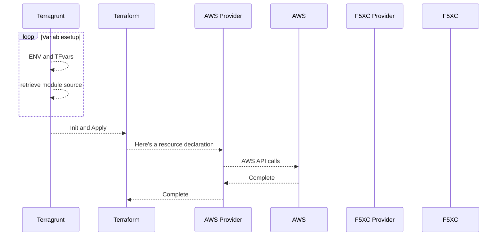
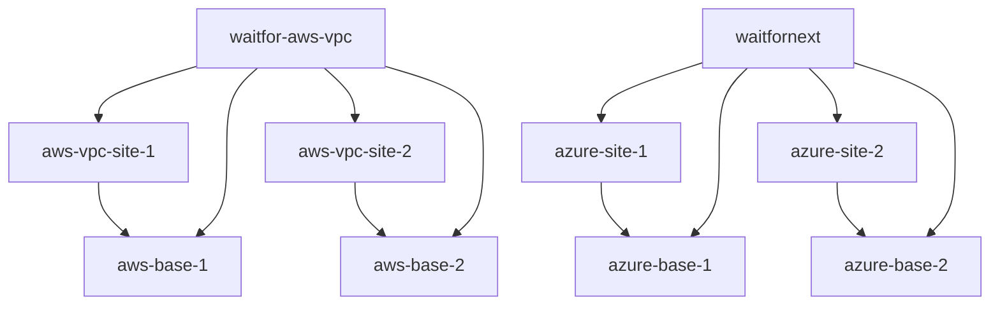

# expensive.food

## Getting Started
This uses terraform and [terragrunt](TERRAGRUNT.md) to deploy resources.

## Preconditions

aws, az, and gcloud CLI installed

credentials with s
- AWS account
- Azure account
- GCP account

Distributed Cloud Cloud Credential for each of the platforms in the same accounts

