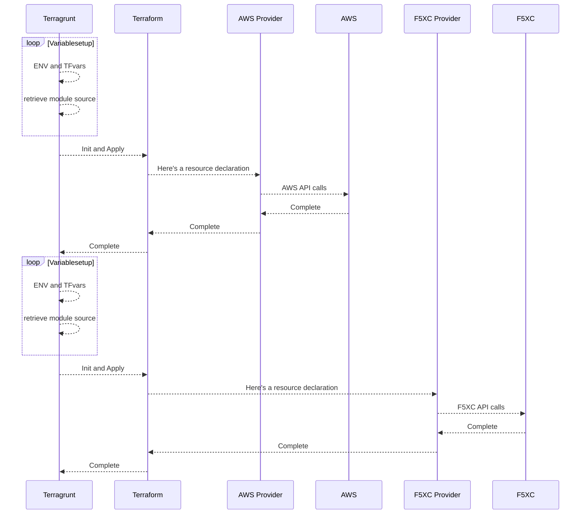
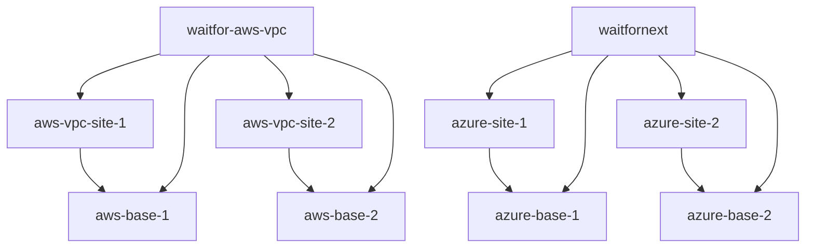

# expensive.food

## Getting Started
This uses terraform and [terragrunt](TERRAGRUNT.md) to deploy resources.

### Tools and Versions tested
[Terraform](https://www.terraform.io/) 1.3.8
[Terragrunt](https://terragrunt.gruntwork.io/) 0.43.2
[Inspec](https://github.com/inspec/inspec) 5.21.29

## Preconditions

aws, az, and gcloud CLI installed

credentials with s
- AWS account
- Azure account
- GCP account

Distributed Cloud Cloud Credential for each of the platforms in the same accounts

